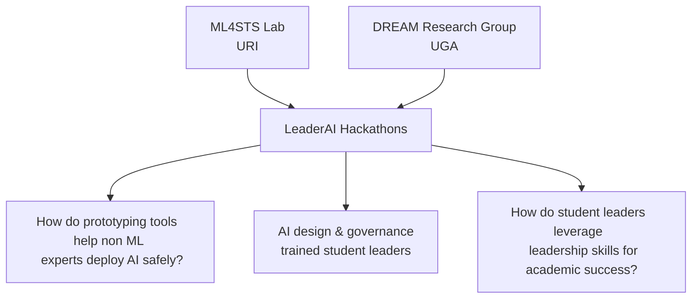
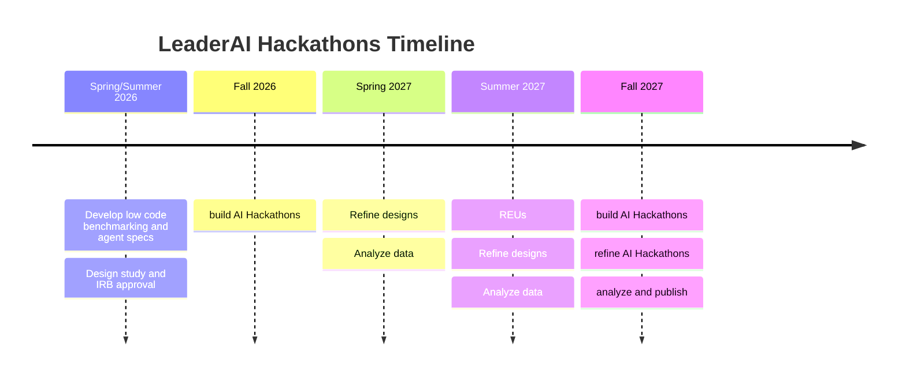
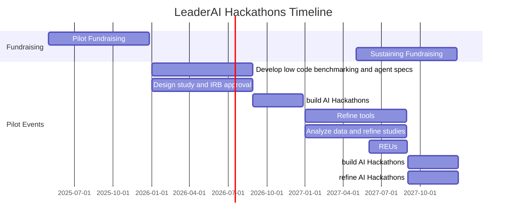

# LeaderAI Hackathons
<!-- 
:::{warning}

Events Coming Soon!
::: -->


## Vision


The [](ml4stslab) and the [](dreamlab) are partnering to prepare the next generation of engineering and tech leaders to build skill in AI deployment and governance. 




::::{margin}
:::{warning}
the diagrams do not render well in dark mode yet, use the toggle at the top of the page to view in light mode
:::
::::

::::{tab-set}
:::{tab-item} Hackathons
:sync: laih

Leader AI hackathons will bring together student leaders to build AI-powered tools that help
improve organization functionality. 

We belive that AI governance and design skills are essential to safe AI for all. We hope to cultivate these skills in future tech leaders, focusing on those leading diverse engineering and stem student orgs to start. 


:::
:::{tab-item} ML4STS Research
:sync: ml

We will develop and evaluate tools for prototyping AI workflows and rigorously evaluating AI models and tools. Our findings will help inform best practices on how to democratize access to both building and evaluating AI to people with a variety of disciplinary backgrounds. 

:::
:::{tab-item} DREAM Research Group
:sync: ee

We will examine how student leaders think about what they do as leaders, their metacognition, in order to determine how they translate that experience into academic and professional success.  Our findings will help inform organizations on how to structure leadership experiences and educators on how to best support students. 

:::
::::


## Plan 

::::{tab-set}
:::{tab-item} Hackathons
:sync: laih

Each Hackathon will be a 2 day event. 

````{list-table} Event Structure
:header-rows: 1

* - Day 1
  - Day 2
* - * hands-on how to build and evaluate workshop
    * brain storming
    * team formation 
    * work time
  - * work time
    * presentations 
    * hands-on launch & maintain workshop
````


Starting in year 2, we will host 2 types of Hackathons: 
- **build hackathons** for new participants to build a new AI tools to support functions related to their leadership role
- **refine hackathons** for returning participants to refine and develop more robust governance and support infrastructure for their AI tool

:::
:::{tab-item} ML4STS Research
:sync: ml

### Key Questions

- What features in AI design tools most help novice designers? 
- What features in benchmarking tools most help people with limited experience in statistics and testing make rigorous claims about AI they interact with?
- What features in benchmarking tools and what types of statistics most improve confidence in an AI application?
- What types of errors are are most common in AIs developed by non AI experts? 

### Method

We will develop tools to support and scaffold the AI building. We will analyze how these tools are used throughout the hackathon through code analysis and how they impact the participants using them through surveys. 

We will also evaluate the benchmarks developed by the teams in the hackathon for their test-driven design and then apply our own thorough evaluation of their AIs. 

:::
:::{tab-item} DREAM Research Group
:sync: ee


### Key Questions

- What leadership skills do students find most salient/transferable in their academic careers?
- How do student leaders apply these skills in their academic careers?
- What opportunities do student leaders have to employ these skills in academic settings?

### Method
Participants' interactions with the AI will be analyzed using iterative inductive coding methods and refined to identify emergent themes in the data.

We will also interview a sample of participants to get a more in-depth understanding of this phenomenon to better support our conclusions. Interviews will be professionally transcribed and abductively coded using themes that emerged from the AI interactions as well as allowing for new themes to surface based on the interviews.

:::
::::

## Timeline

We are currently fundraising to support the program and expect to launch in Spring 2026! 


<!-- 
::::{tab-set}
:::{tab-item} Semesters




:::
:::{tab-item} Detailed 
 -->



<!-- 
:::
:::: -->

## Impact

::::{tab-set}
:::{tab-item} Hackathons
:sync: laih

- X student leaders at 2 universities trained in AI deployment and governance
- Y deployed and tested AI applications that assist student organizations

:::
:::{tab-item} ML4STS Research
:sync: ml

- usable benchmarking tools
- agent development frame work and/or training matrials
- graduate student supported for two years
- generalizable knowledge about how to support responsible AI development and monitoring

:::
:::{tab-item} DREAM Research Group
:sync: ee

- deeper understanding of the relationship between leadership experiences and academic succcess
- generalized rubric development to enhance leadership experiences
- graduate student supported for two years


:::
::::


## Team 

Dr. Sarah Brown and Dr. Racheida Lewis met as leaders in the National Society of Black Engineers (NSBE), and have experienced first hand the impact of student leadership experiences on our careers.  Through NSBE we learned time management, budgeting, and governance skills that have all been valuable in our careers. Importantly, we have worked together before as leaders in distinct verticals within the Society and with Dr. Lewis serving on a committee chaired by Dr. Brown.

(ml4stslab)=
### ML4STS Lab

The [ML4STS Lab at URI](https://ml4sts.com/) is directed by [Dr. Sarah Brown](https://sarahmbrown.org/), Assistant Professor of Computer Science. The lab focuses on how to do better machine learning by considering the sociotechnical nature of problems from the beginning. Current work focuses on ensuring sociotechnical AI safety by developing tools that help data science practitioners and providing public performance modeling techniques. 


(dreamlab)=
### DREAM Research Group 

The [DREAM Research Group at UGA](https://dream.racheidalewis.com/) is directed by [Dr. Racheida Lewis](https://www.racheidalewis.com/), Assistant Professor in the Engineering Education Transformations Institute (EETI) and the School of Electrical and Computer Engineering. 
