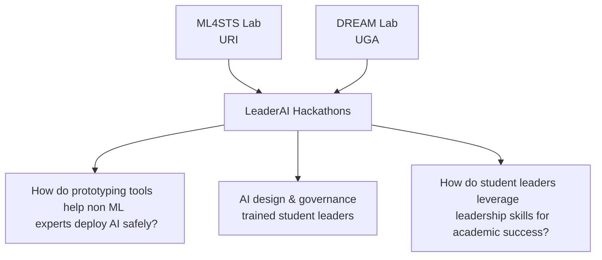
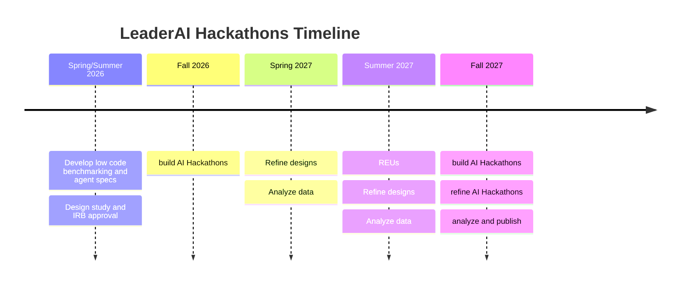
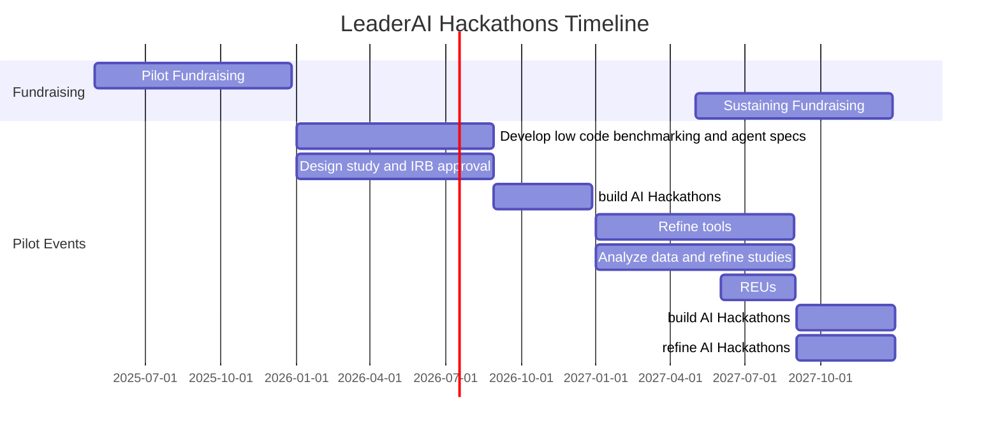

# LeaderAI Hackathons
<!-- 
:::{warning}

Events Coming Soon!
::: -->

## Vision

The [ML4STS Lab at URI](https://ml4sts.com/) and the [DREAM Lab at UGA](https://dream.racheidalewis.com/) are partnering to prepare the next generation of tech leaders to build skill in AI deployment and governance. 

::::{tab-set}
:::{tab-item} Core Events
:sync: laih
Leader AI hackathons will bring together student leaders to build AI-powered tools that help
improve organizataion functionality
:::
:::{tab-item} ML4STS Research
:sync: ml
The 
:::
:::{tab-item} DREAM Research
:sync: ee
Tab two
:::
::::

## Timeline

We are currently fundraising to support the program and expect to launch in Spring 2026! 

::::{tab-set}
:::{tab-item} Key Events

:::
:::{tab-item} Detailed 

:::
::::